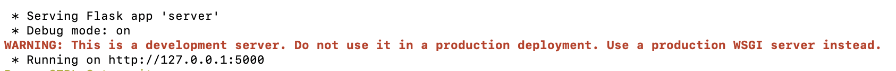
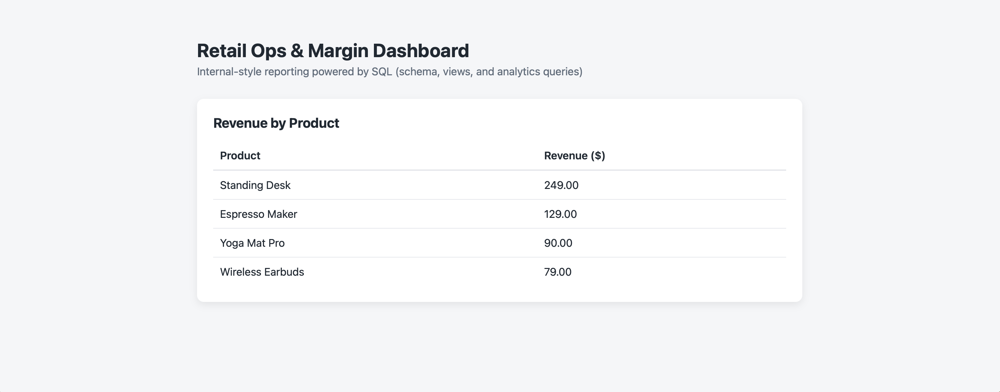

SQL Ops Dashboard

A backend-focused operations dashboard built to manage and query operational data using SQL.

Screenshots

Tech Stack
- Python
- SQL
- Backend-focused architecture

Features
- Query and analyze operational data
- Structured data management
- Backend-driven logic

Notes
This project is backend-focused and not deployed. Code and screenshots demonstrate functionality.
