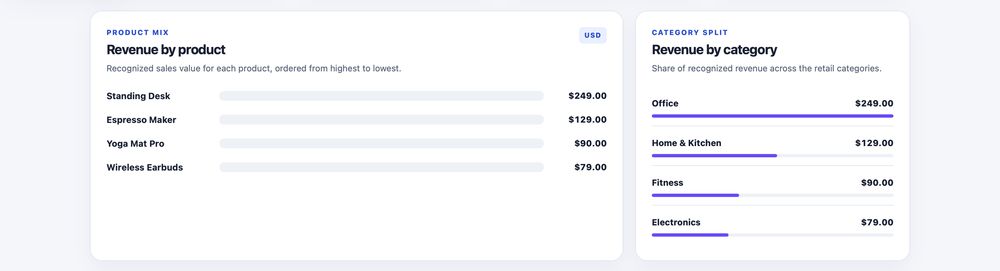
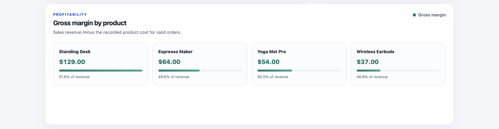
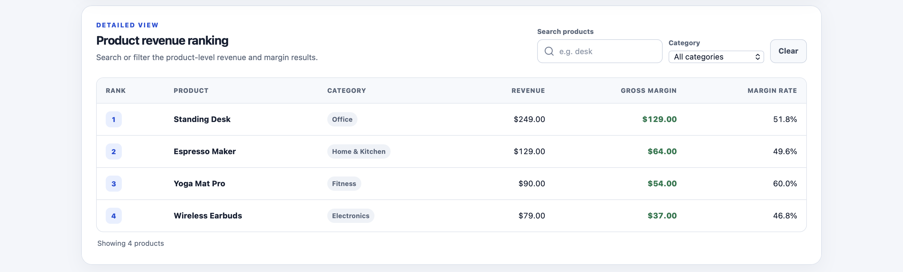

# SQL Ops Dashboard

SQL Ops Dashboard is a local portfolio project that presents generated retail
operations data through a Flask application, JSON APIs, relational SQLite
storage, and a responsive browser dashboard.

The project exists to demonstrate a small, inspectable data workflow: structured
records are stored with SQL constraints, analytics views transform transactional
data, Flask transfers numeric results as JSON, and vanilla JavaScript presents
those results without a frontend framework.

## Screenshots

### Dashboard Overview


### Revenue Analysis


### Gross Margin by Product


### Product Ranking and Filters


## Main features

- Summary metrics for recognized revenue, gross margin, valid orders, and active
  products
- Product and category revenue analysis
- Product gross-margin analysis and revenue ranking
- Responsive horizontal bar charts built with HTML and CSS
- Searchable and category-filterable product table
- Loading, empty-data, and API-error states
- Accessible labels, semantic regions, live status updates, and visible keyboard
  focus
- Rebuildable SQLite database with versioned schema, seed, and analytics SQL
- Controlled database error responses and request-scoped connection cleanup
- Automated API, database integrity, foreign-key, static asset, and failure tests

## Technologies

- Python 3.10 or newer
- Flask 3
- SQLite 3
- HTML5
- CSS
- Vanilla JavaScript
- pytest

## Project structure

```text
app/
├── __init__.py          # Application factory and error handling
├── db.py                # Request-scoped SQLite access
├── routes.py            # Page, health, and JSON API routes
├── static/
│   ├── app.js           # Data retrieval, charts, filters, and UI states
│   └── styles.css       # Responsive dashboard presentation
└── templates/
    └── index.html       # Semantic single-page dashboard
data/
└── ops.db               # Ready-to-run demonstration database
screenshots/
├── 01-dashboard-overview.png
├── 02-revenue-analysis.png
├── 03-gross-margin-by-product.png
└── 04-product-ranking-and-filters.png
scripts/
├── __init__.py
└── init_db.py           # Atomic database rebuild utility
sql/
├── schema.sql           # Tables, constraints, relationships, and indexes
├── seed.sql             # Generated demonstration records
└── views.sql            # Reusable analytics views
tests/
├── conftest.py          # Temporary database and Flask fixtures
├── test_app.py          # Page, asset, API, ordering, total, and error tests
└── test_database.py     # Rebuild, integrity, and foreign-key tests
.gitignore
README.md
requirements.txt
requirements-dev.txt
run.py
```

## Database schema

The database uses seven related tables:

- `customers` stores generated customer names and reserved demonstration email
  addresses.
- `suppliers` stores generated supplier records and active status.
- `categories` classifies products.
- `products` references categories and suppliers and stores cost, price, and
  active status.
- `inventory_movements` records inbound, outbound, and adjustment quantities.
- `orders` references customers and restricts status values with a `CHECK`
  constraint.
- `order_items` connects orders to products, validates positive quantities, and
  cascades when an order is deleted.

SQLite foreign-key enforcement is enabled for application and initialization
connections. Indexes cover the foreign-key columns used in joins and the order
status used by analytics filters.

Money is stored as integer cents in transactional tables. API queries convert it
to numeric dollar values at the presentation boundary.

## Analytics views

- `revenue_by_product` aggregates paid and shipped order revenue by product.
- `revenue_by_category` aggregates recognized revenue by category.
- `margin_by_product` calculates revenue, product cost, and gross margin.
- `product_revenue_rank` applies a SQL window function to rank product revenue.
- `dashboard_summary` returns the four top-level dashboard metrics.

`CANCELLED`, `REFUNDED`, and uncompleted `PLACED` orders are excluded from
recognized revenue and margin.

## API routes

| Method | Route | Purpose |
| --- | --- | --- |
| `GET` | `/` | Render the dashboard |
| `GET` | `/health` | Confirm Flask and SQLite availability |
| `GET` | `/api/summary` | Return overview metrics |
| `GET` | `/api/revenue/products` | Return product revenue in descending order |
| `GET` | `/api/revenue/categories` | Return category revenue |
| `GET` | `/api/margins/products` | Return product revenue, cost, and margin |
| `GET` | `/api/rankings/products` | Return ranked product revenue |

API money values are JSON numbers in US dollars, not formatted strings. Currency
formatting is applied in the browser.

## Installation and usage

The commands below are separated by operating system. `python3` is commonly used
to invoke Python on macOS and Linux, while the Windows PowerShell examples use
the Python launcher command `py`.

### macOS and Linux

From the repository root, create and activate a virtual environment and install
the runtime dependencies:

```bash
python3 -m venv .venv
source .venv/bin/activate
python3 -m pip install --upgrade pip
python3 -m pip install -r requirements.txt
```

Rebuild the default database from the versioned SQL files:

```bash
python3 scripts/init_db.py
```

To initialize a separate database and create any missing parent directories:

```bash
python3 scripts/init_db.py data/portfolio-copy.db
```

Start the application:

```bash
python3 run.py
```

Then open <http://127.0.0.1:5000>. Debug mode is disabled by default. To use
Flask's optional development mode instead:

```bash
python3 -m flask --app app run --debug
```

To install the test dependency and run the full test suite:

```bash
python3 -m pip install -r requirements-dev.txt
python3 -m pytest -q
```

### Windows PowerShell

From the repository root, create and activate a virtual environment and install
the runtime dependencies:

```powershell
py -m venv .venv
.venv\Scripts\Activate.ps1
py -m pip install --upgrade pip
py -m pip install -r requirements.txt
```

If PowerShell blocks local activation scripts, the environment's Python
executable can be called directly as `.venv\Scripts\python.exe`.

Rebuild the default database from the versioned SQL files:

```powershell
py scripts\init_db.py
```

To initialize a separate database and create any missing parent directories:

```powershell
py scripts\init_db.py data\portfolio-copy.db
```

Start the application:

```powershell
py run.py
```

Then open <http://127.0.0.1:5000>. Debug mode is disabled by default. To use
Flask's optional development mode instead:

```powershell
py -m flask --app app run --debug
```

To install the test dependency and run the full test suite:

```powershell
py -m pip install -r requirements-dev.txt
py -m pytest -q
```

The database initialization utility builds and validates a temporary database
before atomically replacing the requested output file. A failed rebuild leaves
the previous database in place and returns a non-zero exit status.

Tests rebuild and use temporary SQLite databases. They do not modify
`data/ops.db`.

The application currently runs locally and is not yet hosted online.

## What this project demonstrates

- Python backend development with an application factory, type hints, logging,
  and focused modules
- Flask routing, template rendering, static file delivery, and JSON APIs
- Relational database design for customers, suppliers, products, inventory, and
  orders
- SQL constraints, foreign keys, cascades, and query-supporting indexes
- SQL views, grouped analytics, gross-margin calculations, and window-function
  ranking
- Data retrieval and transfer from SQLite through Flask to the browser
- Frontend presentation with responsive, accessible HTML, CSS, and vanilla
  JavaScript

## Demonstration data

Every customer, supplier, product, inventory movement, order, and contact address
in this repository is generated demonstration data. Email addresses use reserved
example domains and should not be treated as real contact information.
