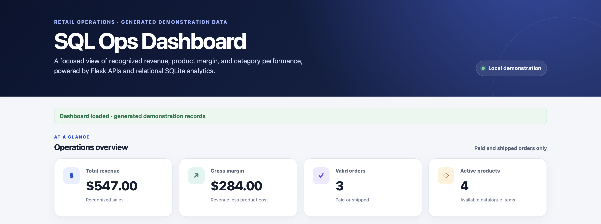
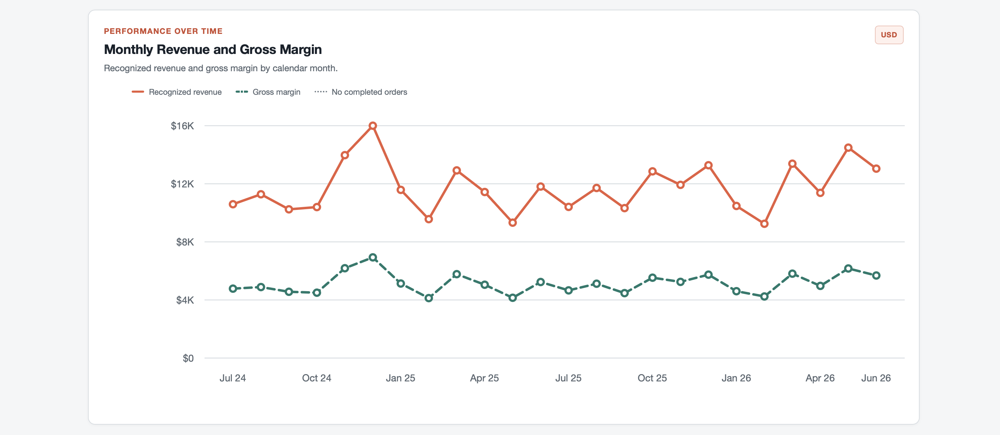
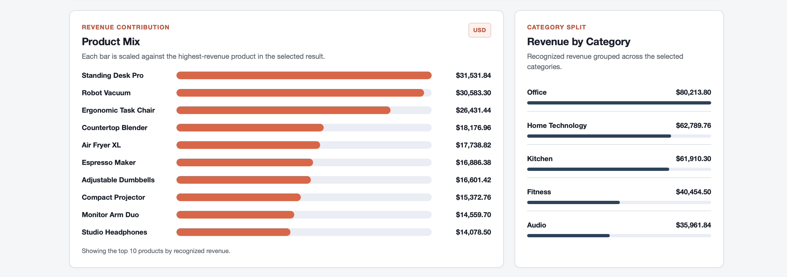
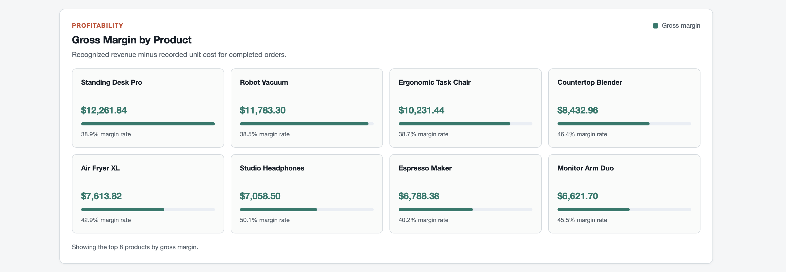
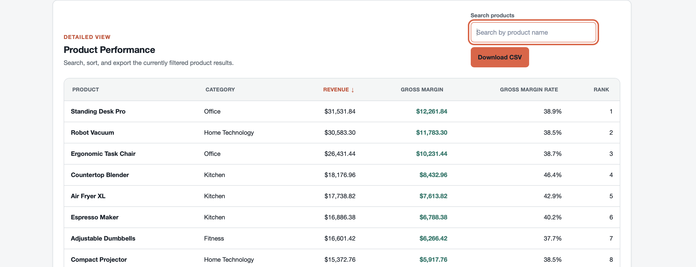
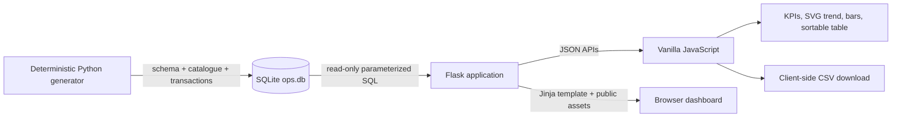

# SQL Ops Dashboard

[](https://github.com/DevRumiTech/sql-ops-dashboard/actions/workflows/tests.yml)

SQL Ops Dashboard is a read-only retail analytics portfolio project. It uses
Python and Flask to validate dashboard filters, query a relational SQLite
database, and transfer numeric analytics through JSON APIs. A responsive HTML,
CSS, and vanilla JavaScript interface presents recognized revenue, product
margin, category performance, monthly trends, and sortable product results.

**Live Demo:** [https://sql-ops-dashboard.vercel.app](https://sql-ops-dashboard.vercel.app)

All records are generated demonstration data. Local setup instructions are
included below.

## Screenshots

### 1. Dashboard Overview



Introduction, dashboard filters, selected data period, and operational summary metrics.

### 2. Monthly Revenue and Gross Margin



Monthly recognized revenue and gross-margin trends across the selected period.

### 3. Product Mix and Category Revenue



Top products by recognized revenue and revenue distribution across product categories.

### 4. Gross Margin by Product



Highest-performing products ranked by gross-margin amount and margin rate.

### 5. Product Performance and Export



Searchable and sortable product results with revenue, gross margin, margin rate, rank, and CSV export.

## Features

- Four filtered KPIs with equal-length prior-period comparisons
- Date presets, custom date range, and category filters shared by every metric
  and chart
- Monthly recognized-revenue and gross-margin SVG chart
- Product and category revenue analysis with value-derived bar lengths
- Product margin analysis and SQL window-function revenue ranking
- Searchable and sortable product performance table
- Browser-generated CSV download using the filtered, searched, and sorted rows
- Loading, empty-data, partial-failure, and controlled API-error states
- Read-only SQLite connections for all application requests
- Deterministic 24-month data generation with integrity validation
- Responsive and keyboard-accessible presentation without a frontend framework
- Ruff, pytest, pytest-cov, and a two-version GitHub Actions workflow

## Technologies

- Python 3.10 or newer
- Flask 3
- SQLite 3
- HTML5
- CSS
- Vanilla JavaScript and accessible SVG
- pytest and pytest-cov
- Ruff
- GitHub Actions

Runtime dependencies are intentionally limited to Flask and its transitive
dependencies. The dashboard does not use an ORM, authentication, external APIs,
third-party chart packages, analytics tracking, or writable web endpoints.

## Architecture


```mermaid
flowchart LR
    G[Deterministic Python generator] -->|schema + catalogue + transactions| D[(SQLite ops.db)]
    D -->|read-only parameterized SQL| F[Flask application]
    F -->|JSON APIs| J[Vanilla JavaScript]
    F -->|Jinja template + public assets| B[Browser dashboard]
    J --> S[KPIs, SVG trend, bars, sortable table]
    J --> C[Client-side CSV download]
```

Database creation is separate from the web application. `scripts/init_db.py`
delegates to the single deterministic generation system, validates SQLite
integrity and foreign keys, and atomically replaces the requested database.
Flask startup and HTTP requests never rebuild or modify the database.

## Project structure

```text
.github/workflows/tests.yml  # Python 3.10/3.12 quality workflow
app/
├── __init__.py              # Application factory, errors, security headers
├── db.py                    # Request-scoped read-only SQLite access
├── filters.py               # Shared date and category validation
├── routes.py                # Page, health, metadata, and analytics APIs
└── templates/
    └── index.html           # Semantic single-page dashboard
data/
└── ops.db                   # Ready-to-run generated database
public/
├── app.js                   # Filters, charts, sorting, CSV, UI states
├── favicon.svg              # Original analytics favicon
└── styles.css               # Responsive dashboard styling
screenshots/                 # Five dashboard presentation images
scripts/
├── generate_demo_data.py    # Seeded transaction generator
└── init_db.py               # Documented database rebuild entry point
sql/
├── schema.sql               # Tables, constraints, keys, and indexes
├── seed.sql                 # Reference categories and product catalogue
└── views.sql                # Inspectable reusable analytics views
tests/
├── conftest.py              # Isolated temporary database fixtures
├── test_app.py              # Page, API, filters, security, read-only tests
├── test_database.py         # Determinism, distribution, integrity tests
└── test_scripts.py          # Generator commands and failure paths
index.py                     # Vercel-compatible Flask application instance
run.py                       # Local development entry point
pyproject.toml               # Ruff and pytest configuration
requirements.txt             # Runtime dependency
requirements-dev.txt         # Test, coverage, and lint dependencies
.vercelignore                # Excludes development-only deployment files
```

## Generated dataset

The default database is generated with random seed `42` for 24 complete months,
from `2024-07-01` through `2026-06-30`. It contains:

- 5 product categories
- 20 products, including active and inactive catalogue items
- 360 completed orders
- 24 pending orders
- 24 cancelled orders
- 944 order-line records
- Completed sales in every month and every category

Prices, recorded unit costs, quantities, discounts, sales channels, product
weights, and seasonal patterns vary deterministically. Pending and cancelled
orders have line records but never contribute to recognized revenue, cost of
goods, gross margin, rankings, or trends. The dataset contains no customer
names, email addresses, postal addresses, telephone numbers, or other personal
information.

Running the generator repeatedly with the same database path, seed, ending
date, and month count produces the same logical records.

## Database schema

Money is stored as integer cents in transactional tables and returned as numeric
US-dollar values by the APIs.

- `categories` contains the five reference category records.
- `products` stores SKU, category relationship, unit cost, list price, and
  active status.
- `orders` stores an ISO order date, constrained status, and generated sales
  channel.
- `order_items` relates orders to products and records quantity, selling price,
  and unit cost at the time represented by the order.

Foreign keys enforce product/category and order-line relationships. Order-item
rows cascade only when an order is deliberately removed by an offline database
maintenance operation; the dashboard itself cannot delete records.

### Important indexes

- `idx_orders_status_date` supports the completed-status and date-range
  predicates used by every analytics query.
- `idx_order_items_order_id` and `idx_order_items_product_id` index SQLite
  foreign-key join columns.
- `idx_products_category_active` supports category and active-product lookups.

No index is included without a corresponding join or filter use.

## Analytics views

- `completed_order_lines` defines the recognized transaction grain and
  calculates revenue, cost, and margin in cents for completed orders.
- `revenue_by_product` aggregates recognized revenue by product.
- `revenue_by_category` aggregates recognized revenue by category.
- `margin_by_product` calculates product revenue, cost, gross margin, and margin
  rate.
- `product_revenue_rank` applies SQLite's `RANK()` window function.
- `monthly_performance` aggregates completed results by calendar month.
- `dashboard_summary` supplies inspectable all-data KPI definitions.

Filtered API queries reuse the same completed-order logic while applying
parameterized dates and category values.

## Metric definitions

- **Recognized revenue:** completed-order quantity multiplied by the recorded
  selling price.
- **Cost of goods:** completed-order quantity multiplied by the recorded unit
  cost.
- **Gross margin:** recognized revenue minus cost of goods.
- **Gross margin rate:** gross margin divided by recognized revenue, multiplied
  by 100. A zero revenue denominator returns `null`/N/A instead of dividing by
  zero.
- **Completed orders:** distinct completed orders in the selected period.
- **Active products:** distinct products marked active in the database that
  appear in completed order lines for the selected period and category.

The APIs return JSON numbers rather than currency-formatted strings. Financial
rounding and US-dollar formatting are applied consistently at the query and
presentation boundaries.

## Filter behavior

The default dashboard period is **Latest 12 months**. Preset periods are
calculated from the latest completed-order date in the dataset rather than the
visitor's current date. Available options are Latest 30 days, Latest 90 days,
Latest 12 months, All available data, and Custom range. Manual start and end
dates are available through Custom range.

The visible **Data through** notice is populated from the maximum
completed-order date returned by the database metadata. Adding newer completed
orders automatically moves that notice and the preset periods forward.

Date and category filters update every KPI and chart. Custom dates use
`YYYY-MM-DD`; invalid dates, repeated values, unsupported parameters, unknown
categories, and reversed ranges return controlled HTTP 400 responses. Valid
filters with no completed records return zero KPIs and empty analytics arrays,
which the interface presents as no-data states.

The first three KPIs compare the selected period with the immediately preceding
period of equal inclusive length. Comparisons are N/A when no valid prior value
exists, when the prior denominator is zero, or when All available data is
selected.

Product search affects only the table. Reset filters returns to Latest 12
months, all categories, empty product search, and Revenue descending sorting.

## API routes

| Method | Route | Purpose |
| --- | --- | --- |
| `GET` | `/` | Render the dashboard |
| `GET` | `/health` | Confirm Flask can open and query SQLite |
| `GET` | `/api/meta` | Return dataset bounds, counts, and categories |
| `GET` | `/api/summary` | Return KPIs and previous-period comparisons |
| `GET` | `/api/trends/monthly` | Return ordered monthly revenue and margin |
| `GET` | `/api/revenue/products` | Return descending product revenue |
| `GET` | `/api/revenue/categories` | Return descending category revenue |
| `GET` | `/api/margins/products` | Return product revenue, cost, and margin |
| `GET` | `/api/rankings/products` | Return ranked product performance |
| `GET` | `/styles.css` | Serve the public stylesheet |
| `GET` | `/app.js` | Serve the public dashboard JavaScript |
| `GET` | `/favicon.svg` | Serve the original SVG favicon |

All analytics routes accept optional `start_date`, `end_date`, and `category`
query parameters:

```text
/api/summary?start_date=2025-07-01&end_date=2026-06-30
/api/trends/monthly?start_date=2026-01-01&end_date=2026-06-30&category=Office
/api/rankings/products?category=Fitness
```

List routes use a consistent envelope containing `count`, `data`, `filters`,
and `generated_data`. The metadata and summary routes provide named `meta` and
`summary` objects.

## Installation and local use

`python3` is commonly used on macOS and Linux. The Windows PowerShell examples
use the Python launcher command `py`. Python 3.10 or newer is supported.

### macOS and Linux

```bash
python3 -m venv .venv
source .venv/bin/activate
python3 -m pip install --upgrade pip
python3 -m pip install -r requirements.txt
python3 scripts/init_db.py
python3 run.py
```

Open <http://127.0.0.1:5000> after the application starts. Debug mode is
disabled by default. Optional Flask development mode can be started with:

```bash
python3 -m flask --app app run --debug
```

### Windows PowerShell

```powershell
py -m venv .venv
.venv\Scripts\Activate.ps1
py -m pip install --upgrade pip
py -m pip install -r requirements.txt
py scripts\init_db.py
py run.py
```

Open <http://127.0.0.1:5000> after the application starts. Optional Flask
development mode can be started with:

```powershell
py -m flask --app app run --debug
```

If PowerShell prevents activation scripts from running, use
`.venv\Scripts\python.exe` directly for the Python commands.

## Database generation

`scripts/init_db.py` uses the deterministic generator defaults and atomically
replaces `data/ops.db` after integrity checks:

```bash
python3 scripts/init_db.py
```

Generate a separate database or change the deterministic arguments:

```bash
python3 scripts/generate_demo_data.py data/portfolio-copy.db \
  --seed 42 \
  --ending-date 2026-06-30 \
  --months 24
```

The ending date must be the final day of a month so the generated period
contains complete calendar months.

## Quality checks

Install development dependencies:

```bash
python3 -m pip install -r requirements-dev.txt
```

Run Ruff:

```bash
python3 -m ruff check .
```

Run the tests:

```bash
python3 -m pytest -q
```

Run the required coverage check:

```bash
python3 -m pytest \
  --cov=app \
  --cov=scripts \
  --cov-report=term-missing \
  --cov-fail-under=85 \
  -q
```

Windows PowerShell uses the equivalent `py -m ruff check .`,
`py -m pytest -q`, and `py -m pytest --cov=app --cov=scripts
--cov-report=term-missing --cov-fail-under=85 -q` commands.

Tests create temporary SQLite databases and never modify `data/ops.db`.

## CSV download

The **Download CSV** button exports the rows currently displayed in the Product
Performance table after global filters, product search, and sorting. The browser
creates a UTF-8 CSV with spreadsheet-ready numeric values and correct escaping;
no data is sent to another service or written by the Flask server. The filename
contains the selected start and end dates.

## Accessibility and responsive behavior

The dashboard uses one H1, structured headings, labelled controls, a status
`aria-live` region, keyboard-operable sorting, valid `aria-sort` states, visible
focus outlines, a table caption, textual comparison directions, and an SVG chart
with a title, description, legend, and screen-reader data summary. Missing chart
months are explicitly identified.

Layouts adapt for desktop, tablet, mobile, and enlarged text. The monthly chart
and product table retain readable labels through narrow-screen horizontal
scrolling. Reduced-motion preferences minimize loading animation.

## Vercel deployment

The root `index.py` exports a Flask instance named `app`, while `run.py` remains
the local entry point. Flask serves the same `public/` assets locally that a
production Vercel deployment uses. The bundled `data/ops.db` requires no
build-time write, environment secret, external database, or writable deployed
filesystem.

`.vercelignore` excludes virtual environments, tests, screenshots, caches,
coverage output, and development-only scripts. Application modules, templates,
public assets, `data/ops.db`, and the SQL documentation remain available. A
`vercel.json` file is not included because the standard Python entry point and
public directory require no additional routing configuration.

The production dashboard is linked near the top of this README.

## What this project demonstrates

- Python application structure with type hints and focused modules
- Flask routing, validation, controlled errors, and JSON APIs
- SQLite relational design, constraints, foreign keys, indexes, and views
- Parameterized SQL and read-only request connections
- Reproducible generated-data processing
- Aggregation, ranking, comparisons, and time-series analytics
- Data retrieval and frontend visualization with no chart dependency
- Accessible table sorting and local CSV data transfer
- Automated testing, coverage measurement, and linting
- Continuous integration across Python 3.10 and 3.12
- Production deployment with a lightweight Flask entry point
